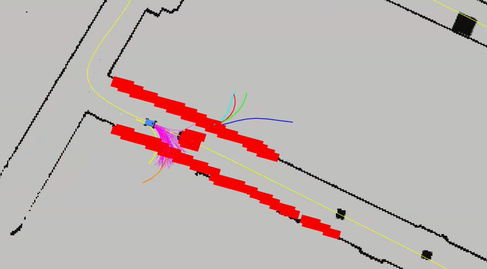
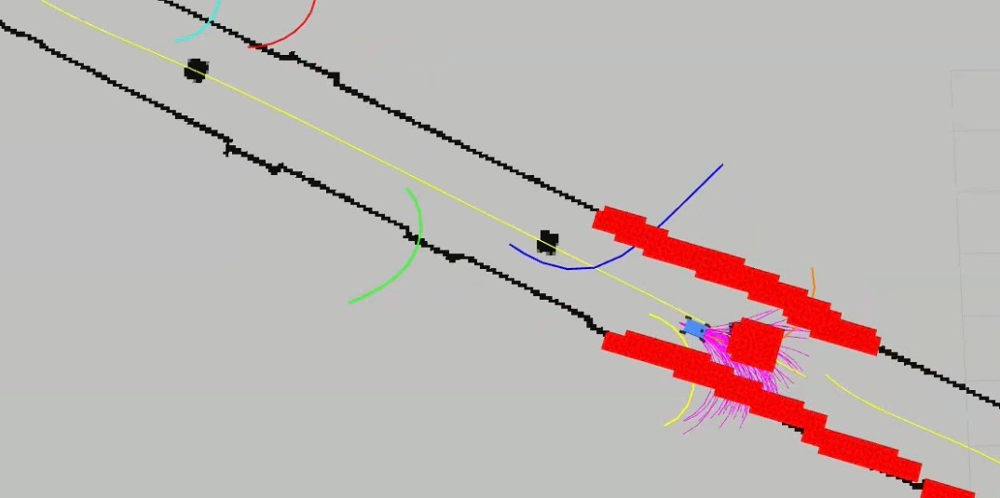
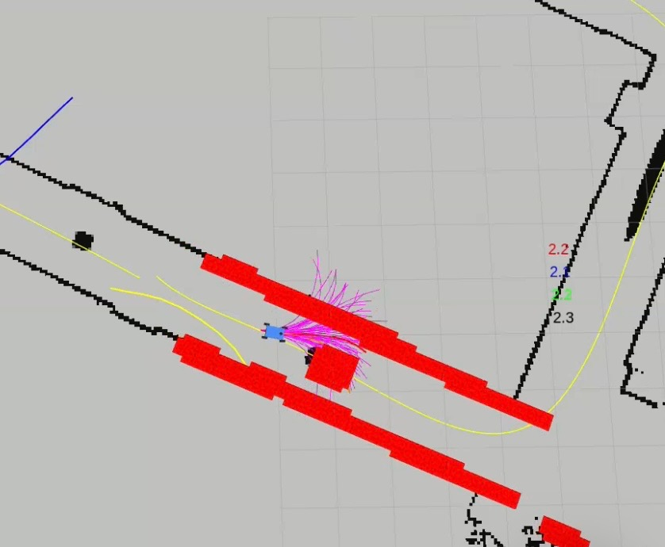

# SVG-MPPI for F1TENTH

Model Predictive Path Integral (MPPI) control augmented with Stein Variational Gradient (SVG) guidance for high-speed autonomous racing on the F1TENTH platform. The repository contains a ROS 2 package that can be run both in simulation and on the real 1/10-scale vehicle.

## Table of Contents
- Features
- Quick Start
- Installation
- Simulation Usage
- Real-Car Usage
- Repository Layout
- Reports & Media
- Contributing
- License
- Citation

## Features
- Real-time MPPI controller written in C++ and Python.
- SVG-MPPI: biases the sampling distribution with Stein Variational Gradient Descent for superior obstacle avoidance.
- Multiple vehicle dynamics models (kinematic bicycle, dynamic bicycle, single-track, …).
- YAML-based configuration and parameter tuning.
- RViz visualization node for particles, trajectories, and cost fields.
- Data-logging utilities for offline analysis.

## Quick Start
Build the package inside a ROS 2 workspace and launch the demo:
```bash
# create/enter your ROS 2 workspace
mkdir -p ~/f1_ws/src && cd ~/f1_ws/src

git clone https://github.com/virmani11kartik/mppi_f1tenth_team4.git
cd ..

colcon build --packages-select mppi
source install/setup.bash

# run the default simulation launch file
ros2 launch mppi example_sim.launch.py
```

## Installation
1. Install ROS 2 (Foxy/Humble recommended). Follow the official instructions for your OS.
2. Install system dependencies:
   ```bash
   sudo apt update && sudo apt install \
        python3-numba python3-cvxpy libeigen3-dev
   ```
3. Clone this repository into the `src` folder of your workspace and build with `colcon` as shown in the Quick Start.
4. Source the workspace every new terminal session: `source ~/f1_ws/install/setup.bash`.

## Simulation Usage
*The repository is agnostic to the specific simulator. The default launch file expects a standard F1TENTH Gazebo world.*

```bash
# example: run controller with a pre-recorded bag of laser scans
ros2 launch mppi mppi_sim_demo.launch.py map:=skirk map_path:=~/maps/skirk.yaml
```
Adjust parameters in `mppi/config/config.yaml` to change horizon length, number of particles, cost weights, etc.

## Real-Car Usage
Launch your regular F1TENTH bring-up (LiDAR, IMU, odometry, etc.) first. In two new terminals run:
```bash
# main controller
ros2 run mppi mppi_node.py

# visualization (optional)
ros2 run mppi vis_node.py
```

## Repository Layout
```text
mppi_f1tenth_team4/
├── mppi/                  # ROS 2 package
│   ├── config/            # YAML configuration files
│   ├── mppi/              # Core Python implementation
│   ├── scripts/           # Executable helper scripts & launch files
│   └── waypoints/         # Example waypoint files
├── plots_experimenral_data/  # Reports, logs, and media (typo kept for backward-compat.)
└── README.md
```

## Reports & Media
1. **Final Project Report (May 2025)** – *Comprehensive analysis and findings.*  
   [PDF](plots_experimenral_data/SVG_MPPI_Final_Report.pdf)

2. **Vehicle Dynamics Log (May 11 2025)**  
   [Commit](https://github.com/virmani11kartik/mppi_f1tenth_team4/commit/c88e4af5b50aebd0fd827ebc319d0b03b2ad6ae1) | [PDF](plots_experimenral_data/car_dynamics_log_05_11_2025.pdf)

3. **MPPI vs SVG-MPPI – Theoretical Analysis & Experiments**  
   Interactive Jupyter notebook that:
   - Derives the MPPI cost functional from stochastic optimal control.
   - Introduces Stein Variational Gradient (SVG) guidance and illustrates its effect on the particle distribution.
   - Compares roll-out trajectories, control actions, and cost evolution between vanilla MPPI and SVG-MPPI.
   - Studies sensitivity to horizon length, noise variance, and obstacle placement.
   
   [Open the notebook](mppi/util/mathematical_analysis.ipynb)





**Simulation insight:** the guide particle is updated by five Stein Variational Gradient Descent iterations. By steering the mean of the particle set away from mid-lane obstacles, SVG-MPPI consistently finds a safe, high-speed trajectory.

## Contributing
Contributions are welcome! Please open an issue to discuss a feature or bug, or directly submit a pull request.

## License
This project is licensed under the MIT License – see the [LICENSE](LICENSE) file for details.

## Citation
If you find this work useful, please consider citing it:
```text
@misc{svg_mppi_2025,
  title        = {SVG-MPPI for F1TENTH},
  author       = {Team 4},
  year         = {2025},
  url          = {https://github.com/virmani11kartik/mppi_f1tenth_team4}
}
```
